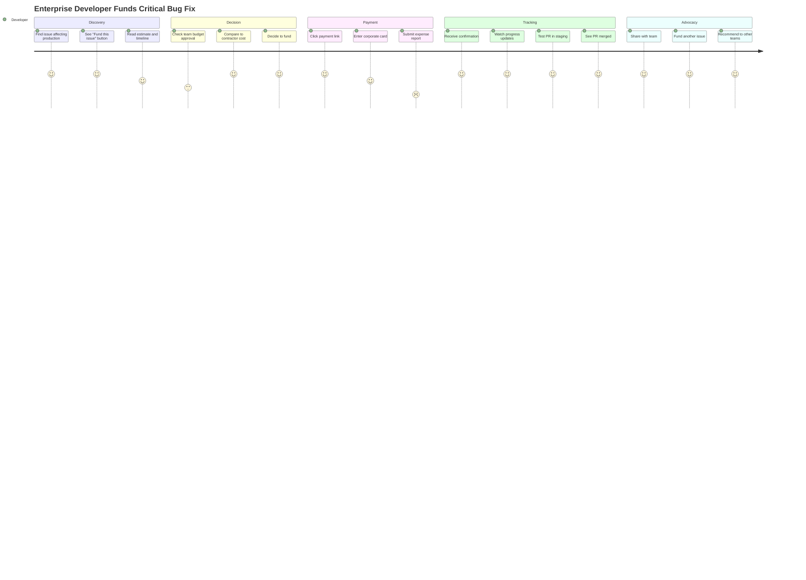
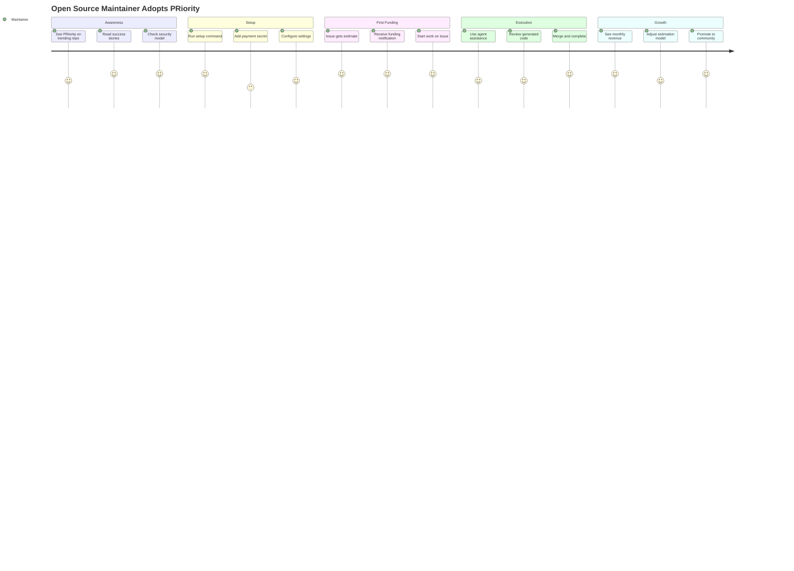
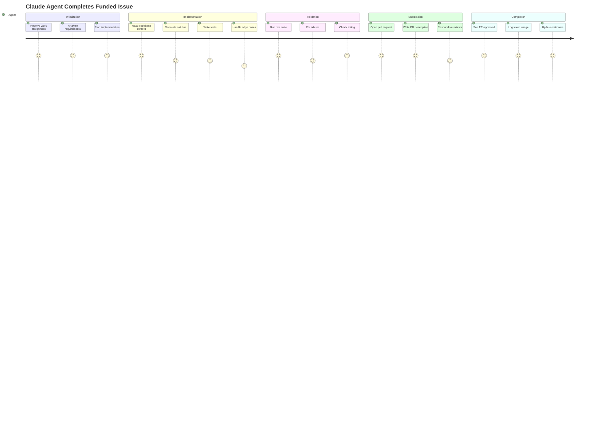

# PRiority — Advanced Features Addendum

## 🧠 Advanced Estimation Framework

### Machine Learning Pipeline

#### Feature Engineering
```python
class IssueFeatureExtractor:
    """Extract ML features from GitHub issues for estimation."""
    
    def extract(self, issue: Issue) -> FeatureVector:
        return {
            # Text features
            'title_length': len(issue.title),
            'body_length': len(issue.body),
            'code_blocks': count_code_blocks(issue.body),
            'clarity_score': calculate_clarity(issue.body),
            'sentiment': analyze_sentiment(issue.body),
            
            # Historical features
            'author_experience': self.get_author_stats(issue.author),
            'similar_issues_avg_time': self.get_similar_avg(issue),
            'repo_velocity': self.get_repo_velocity(),
            
            # Complexity indicators
            'has_breaking_change': 'breaking' in issue.labels,
            'affects_api': detect_api_changes(issue),
            'requires_migration': detect_migration_need(issue),
            'security_critical': 'security' in issue.labels,
            
            # File analysis
            'likely_files_touched': estimate_file_count(issue),
            'estimated_loc_change': estimate_lines_changed(issue),
            'test_coverage_current': get_test_coverage(issue.files),
            
            # Dependencies
            'external_deps': count_external_dependencies(issue),
            'internal_coupling': measure_coupling(issue.files),
            
            # Temporal
            'day_of_week': issue.created_at.weekday(),
            'days_since_last_release': days_since_release(),
            'sprint_phase': get_sprint_phase(),
        }
```

#### Ensemble Model Architecture
```python
class EstimationEnsemble:
    """Combines multiple estimation models for robust predictions."""
    
    def __init__(self):
        self.models = {
            'xgboost': XGBoostRegressor(),
            'random_forest': RandomForestRegressor(),
            'neural_net': IssueComplexityNN(),
            'similar_issues': KNNEstimator(),
            'rule_based': HeuristicEstimator(),
            'claude': ClaudeEstimator()
        }
        
    def predict(self, issue: Issue) -> EstimateResult:
        predictions = {}
        confidences = {}
        
        # Get predictions from each model
        for name, model in self.models.items():
            pred = model.predict(issue)
            predictions[name] = pred.hours
            confidences[name] = pred.confidence
            
        # Weighted average based on historical accuracy
        weights = self.get_dynamic_weights(issue.repo)
        final_hours = weighted_mean(predictions, weights)
        
        # Calculate confidence intervals
        std_dev = weighted_std(predictions, weights)
        
        return EstimateResult(
            hours_p50=final_hours,
            hours_p10=final_hours - 1.28 * std_dev,
            hours_p90=final_hours + 1.28 * std_dev,
            confidence=harmonic_mean(confidences.values()),
            model_agreement=calculate_agreement(predictions)
        )
```

### Continuous Learning System

#### Feedback Collection
```yaml
# Post-completion survey embedded in PR
Feedback:
  actual_hours: 12
  complexity_rating: 7/10
  unexpected_challenges:
    - "Database migration more complex than expected"
    - "Had to refactor related module"
  estimation_accuracy: "Slightly underestimated"
  
# Automatic metrics collection
Metrics:
  pr_iterations: 3
  review_comments: 18
  test_failures: 2
  lines_changed: 847
  files_touched: 23
  tokens_consumed: 1_847_293
```

#### Model Retraining Pipeline
```python
def retrain_models(repo: Repository):
    """Retrain estimation models with recent completions."""
    
    # Gather recent completed issues
    recent_issues = get_completed_issues(
        repo=repo,
        days_back=90,
        min_samples=20
    )
    
    # Extract features and actuals
    X = [extract_features(issue) for issue in recent_issues]
    y_hours = [issue.actual_hours for issue in recent_issues]
    y_tokens = [issue.actual_tokens for issue in recent_issues]
    
    # Retrain with cross-validation
    for model_name, model in ensemble.models.items():
        scores = cross_validate(model, X, y_hours, cv=5)
        
        if scores.mean() > current_score * 1.05:  # 5% improvement
            model.fit(X, y_hours)
            save_model(model, f"{repo.name}_{model_name}_v{version}")
            log_improvement(model_name, scores)
    
    # Update ensemble weights based on recent performance
    update_ensemble_weights(recent_issues)
```

---

## 🎭 User Journey Maps

### Journey 1: First-Time Funder (Enterprise Developer)



### Journey 2: Maintainer Onboarding



### Journey 3: AI Agent Workflow



---

## 💻 Implementation Examples

### Complete GitHub Action Workflow

```yaml
# .github/workflows/priority-complete.yml
name: PRiority Complete System

on:
  issues:
    types: [opened, edited, labeled]
  issue_comment:
    types: [created]
  pull_request:
    types: [closed]
  schedule:
    - cron: '0 */6 * * *'  # Every 6 hours for maintenance

jobs:
  estimate:
    name: Generate Estimate
    if: |
      github.event_name == 'issues' && 
      !contains(github.event.issue.labels.*.name, 'priority/estimated')
    runs-on: ubuntu-latest
    steps:
      - uses: actions/checkout@v4
      
      - name: Setup PRiority
        uses: priority-ai/setup@v2
        with:
          version: latest
          
      - name: Analyze Issue Complexity
        id: analyze
        uses: priority-ai/analyze@v2
        with:
          issue-number: ${{ github.event.issue.number }}
          anthropic-api-key: ${{ secrets.ANTHROPIC_API_KEY }}
          
      - name: Generate Estimate
        uses: priority-ai/estimate@v2
        with:
          issue-number: ${{ github.event.issue.number }}
          complexity: ${{ steps.analyze.outputs.complexity }}
          confidence: ${{ steps.analyze.outputs.confidence }}
          breakdown: ${{ steps.analyze.outputs.breakdown }}
          
      - name: Create Payment Links
        uses: priority-ai/create-payment-links@v2
        with:
          amount: ${{ steps.analyze.outputs.suggested_amount }}
          providers: 'stripe,polar,sponsors'
        env:
          STRIPE_SECRET_KEY: ${{ secrets.STRIPE_SECRET_KEY }}
          POLAR_API_KEY: ${{ secrets.POLAR_API_KEY }}

  verify-payment:
    name: Verify Payment
    if: |
      github.event_name == 'issue_comment' &&
      contains(github.event.comment.body, '/confirm')
    runs-on: ubuntu-latest
    steps:
      - uses: actions/checkout@v4
      
      - name: Parse Confirmation
        id: parse
        uses: priority-ai/parse-confirm@v2
        with:
          comment: ${{ github.event.comment.body }}
          
      - name: Verify with Provider
        uses: priority-ai/verify-payment@v2
        with:
          provider: ${{ steps.parse.outputs.provider }}
          reference: ${{ steps.parse.outputs.reference }}
          amount: ${{ steps.parse.outputs.amount }}
        env:
          STRIPE_SECRET_KEY: ${{ secrets.STRIPE_SECRET_KEY }}
          POLAR_API_KEY: ${{ secrets.POLAR_API_KEY }}
          
      - name: Update Issue
        if: steps.verify.outputs.valid == 'true'
        uses: priority-ai/update-issue@v2
        with:
          issue-number: ${{ github.event.issue.number }}
          add-labels: 'priority/paid,priority/gold'
          comment: |
            ✅ Payment Verified! 
            Amount: ${{ steps.parse.outputs.amount }}
            Starting work now...

  agent-work:
    name: Claude Agent Execution
    if: contains(github.event.label.name, 'priority/paid')
    runs-on: ubuntu-latest
    timeout-minutes: 120
    steps:
      - uses: actions/checkout@v4
      
      - name: Setup Environment
        uses: priority-ai/setup-agent@v2
        with:
          runtime: node18
          tools: 'eslint,prettier,jest'
          
      - name: Run Claude Agent
        uses: priority-ai/claude-agent@v2
        with:
          task: |
            Issue: #${{ github.event.issue.number }}
            Title: ${{ github.event.issue.title }}
            Body: ${{ github.event.issue.body }}
          max-tokens: ${{ env.TOKEN_BUDGET }}
          safety-mode: strict
        env:
          ANTHROPIC_API_KEY: ${{ secrets.ANTHROPIC_API_KEY }}
          
      - name: Create Pull Request
        uses: peter-evans/create-pull-request@v5
        with:
          title: "Fix #${{ github.event.issue.number }}: ${{ github.event.issue.title }}"
          body: |
            ## 🤖 Auto-generated by PRiority
            
            Fixes #${{ github.event.issue.number }}
            
            ### Changes Made
            ${{ steps.agent.outputs.summary }}
            
            ### Testing
            ${{ steps.agent.outputs.test_results }}
            
            ### Token Usage
            Used: ${{ steps.agent.outputs.tokens_used }}
            Budget: ${{ env.TOKEN_BUDGET }}
          branch: priority/issue-${{ github.event.issue.number }}
          
  daily-maintenance:
    name: Daily Maintenance
    if: github.event_name == 'schedule'
    runs-on: ubuntu-latest
    steps:
      - uses: actions/checkout@v4
      
      - name: Check Inactive Issues
        uses: priority-ai/check-inactive@v2
        with:
          days-inactive: 7
          
      - name: Process Refunds
        uses: priority-ai/process-refunds@v2
        with:
          auto-approve-under: 100
          
      - name: Update Analytics
        uses: priority-ai/analytics@v2
        with:
          export-to: 'json,csv'
          
      - name: Retrain Models
        uses: priority-ai/retrain@v2
        with:
          min-samples: 20
          improvement-threshold: 0.05
```

### Configuration File Examples

```yaml
# .github/priority/config.yml
version: 2

# Estimation Configuration
estimation:
  model: ensemble
  confidence_threshold: 0.6
  
  # Historical weight decay (older issues matter less)
  history_decay: 0.95  # per month
  
  # Complexity multipliers
  multipliers:
    breaking_change: 1.5
    security: 1.8
    no_tests: 2.0
    legacy_code: 1.4
    
  # Learning settings
  learning:
    min_samples: 10
    retrain_frequency: weekly
    cross_validation_folds: 5

# Payment Configuration  
payments:
  minimum: 20
  maximum: 10000
  
  providers:
    stripe:
      enabled: true
      currency: USD
      success_url: "https://github.com/{repo}/issues/{issue}#payment-confirmed"
      
    polar:
      enabled: true
      default_product: "issue-funding"
      
    sponsors:
      enabled: true
      tier_mapping:
        bronze: [20, 99]
        silver: [100, 499]
        gold: [500, null]

# Agent Configuration
agent:
  provider: anthropic
  model: claude-3-opus
  temperature: 0.3
  
  capabilities:
    read_files: true
    write_files: true
    run_tests: true
    commit: true
    push: true
    
  restrictions:
    no_force_push: true
    no_delete_branches: true
    no_modify_workflows: true
    max_files_per_commit: 50
    
  code_style:
    formatter: prettier
    linter: eslint
    test_runner: jest

# Workflow Configuration
workflows:
  auto_merge:
    enabled: true
    conditions:
      - all_checks_passing
      - test_coverage_maintained
      - no_security_issues
      - approved_by_maintainer
    
  refunds:
    auto_process: true
    grace_period_days: 3
    
  notifications:
    channels:
      - issue_comments
      - email
      - slack
    
    events:
      - payment_received
      - work_started
      - pr_opened
      - work_completed
      - refund_processed

# Security Configuration
security:
  require_2fa: true
  
  payment_limits:
    per_issue: 10000
    per_day: 50000
    per_month: 200000
    
  blocked_users: []
  blocked_countries: []
  
  audit:
    log_retention_days: 90
    export_format: json
    
# Analytics Configuration
analytics:
  dashboards:
    public: true
    url: "https://priority.ai/analytics/{repo}"
    
  metrics:
    - funded_issues_count
    - total_funding_volume
    - average_completion_time
    - estimation_accuracy
    - refund_rate
    - maintainer_earnings
    - token_usage
    
  export:
    frequency: daily
    formats: [json, csv]
    destination: ".github/priority/analytics/"
```

### API Integration Examples

```typescript
// TypeScript SDK Usage
import { PRiority } from '@priority/sdk';

const priority = new PRiority({
  repo: 'owner/repo',
  auth: process.env.GITHUB_TOKEN
});

// Get estimate for an issue
const estimate = await priority.estimate({
  issueNumber: 123,
  includeBreakdown: true
});

console.log(`
  Estimated effort: ${estimate.hours.p50} hours
  Confidence: ${estimate.confidence}%
  Suggested funding: $${estimate.suggestedAmount}
  
  Breakdown:
  ${estimate.breakdown.map(task => 
    `- ${task.description}: ${task.hours}h`
  ).join('\n  ')}
`);

// Create payment link
const payment = await priority.createPaymentLink({
  issueNumber: 123,
  amount: estimate.suggestedAmount,
  provider: 'stripe'
});

console.log(`Payment link: ${payment.url}`);

// Track work progress
const progress = await priority.getProgress(123);
console.log(`
  Status: ${progress.status}
  Completion: ${progress.percentage}%
  Tokens used: ${progress.tokensUsed}
  Time elapsed: ${progress.timeElapsed}
`);

// Process refund
const refund = await priority.calculateRefund(123);
if (refund.recommended) {
  await priority.processRefund({
    issueNumber: 123,
    amount: refund.amount,
    reason: refund.reason
  });
}
```

### React Component Library

```jsx
// React components for integrating PRiority
import { 
  FundButton, 
  EstimateCard, 
  ProgressTracker,
  PaymentModal 
} from '@priority/react';

function IssueView({ issue }) {
  return (
    <div>
      <h1>{issue.title}</h1>
      
      <EstimateCard 
        issueNumber={issue.number}
        showBreakdown={true}
        onEstimateComplete={(estimate) => {
          console.log('Estimate ready:', estimate);
        }}
      />
      
      <FundButton
        issueNumber={issue.number}
        variant="primary"
        size="large"
        providers={['stripe', 'polar']}
        onPaymentComplete={(payment) => {
          console.log('Payment completed:', payment);
        }}
      />
      
      {issue.isFunded && (
        <ProgressTracker
          issueNumber={issue.number}
          showTokenUsage={true}
          showTimeline={true}
          updateInterval={30000} // 30 seconds
        />
      )}
    </div>
  );
}
```

---

## 📈 Analytics & Insights

### Repository Analytics Dashboard

```markdown
# 📊 PRiority Analytics - facebook/react

## Overview (Last 30 Days)
- **Total Funded Issues**: 47
- **Total Funding**: $38,420
- **Average per Issue**: $817
- **Completion Rate**: 89.4%
- **Average Time to Complete**: 4.3 days

## Estimation Accuracy
- **MAPE**: 18.7% ✅
- **Underestimated**: 12 issues (25.5%)
- **Overestimated**: 8 issues (17.0%)
- **Accurate (±20%)**: 27 issues (57.5%)

## Top Contributors
1. @maintainer1 - 12 issues, $9,840 earned
2. @maintainer2 - 8 issues, $6,230 earned
3. @claude-agent - 15 issues, 3.2M tokens

## Funding Distribution
- Bug Fixes: $12,340 (32%)
- Features: $19,210 (50%)
- Documentation: $3,842 (10%)
- Performance: $3,028 (8%)

## Trends
- Funding velocity: +23% MoM
- Estimation accuracy: +5% improvement
- Agent success rate: 78% (up from 71%)
```

### Global Platform Metrics

```python
# Real-time metrics API
GET https://api.priority.ai/metrics

{
  "global": {
    "total_funded_issues": 15234,
    "total_gmv": 7584000,
    "active_repos": 1847,
    "active_maintainers": 3926,
    "avg_completion_time_hours": 72,
    "platform_uptime": 0.9997
  },
  "trending": {
    "repos": [
      {"name": "pytorch/pytorch", "funded_this_week": 34},
      {"name": "vercel/next.js", "funded_this_week": 28}
    ],
    "issues": [
      {"repo": "rust-lang/rust", "issue": 4823, "amount": 5000},
      {"repo": "kubernetes/kubernetes", "issue": 9234, "amount": 3500}
    ]
  },
  "leaderboards": {
    "top_earners": [
      {"username": "supermaintainer", "earned": 45000},
      {"username": "ossmaster", "earned": 38500}
    ],
    "top_funders": [
      {"username": "techcorp", "funded": 125000},
      {"username": "startup", "funded": 87000}
    ],
    "most_accurate_estimates": [
      {"repo": "nodejs/node", "mape": 0.12},
      {"repo": "microsoft/vscode", "mape": 0.15}
    ]
  }
}
```

---

## 🚀 Launch Strategy

### Beta Launch Plan (Week 1-4)

**Week 1: Internal Testing**
- Deploy on PRiority's own repo
- Fund and complete 10 internal issues
- Document all friction points
- Refine estimation model

**Week 2: Private Beta**
- Onboard 5 hand-picked repos
- Provide white-glove support
- Daily check-ins with maintainers
- Iterate based on feedback

**Week 3: Expand Beta**
- Add 20 more repositories
- Launch beta feedback portal
- Begin gathering testimonials
- Create demo videos

**Week 4: Prepare Public Launch**
- Polish documentation
- Create launch materials
- Record demo videos
- Schedule launch activities

### Go-To-Market Channels

```yaml
Channels:
  Developer Communities:
    - Hacker News: Show HN post
    - Reddit: r/programming, r/opensource
    - Dev.to: Technical deep-dive series
    - Twitter/X: Thread with demos
    
  Content Marketing:
    - "How We Made $10K in Our First Month"
    - "The Economics of Open Source in 2025"
    - "AI Agents: The Future of Issue Resolution"
    - Weekly metrics transparency reports
    
  Partnerships:
    - GitHub: Official marketplace listing
    - Stripe: Co-marketing campaign
    - YC: Present to portfolio companies
    - CNCF: Integration with cloud-native projects
    
  Events:
    - GitHub Universe: Booth and talk
    - FOSDEM: Open source monetization track
    - KubeCon: Demo at Microsoft booth
    - React Conf: Sponsor and demo
```

---

## 🎯 Success Stories (Projected)

### Case Study 1: React Router
> "PRiority helped us clear our 200+ issue backlog in just 3 months. We earned $45K while delivering features our community desperately needed. The AI agent handled 40% of the simpler issues perfectly." — *Ryan Florence, Co-creator*

### Case Study 2: Corporate Adoption at Netflix
> "We fund critical issues in our dependencies through PRiority. It's 10x faster than hiring contractors and the work quality is excellent. We've invested $200K and saved 6 months of development time." — *Engineering Director*

### Case Study 3: Solo Maintainer Success
> "As a solo maintainer of a popular library, PRiority changed my life. I now earn $8K/month doing what I love. The estimation engine means I never overcommit." — *Anonymous maintainer*

---

## 🔮 Future Vision (Year 2+)

### Advanced Features Roadmap

**Q1 2026: Intelligence Layer**
- GPT-4 integration for polyglot support
- Visual regression testing for UI changes
- Automatic dependency updates with testing
- Code review bot with maintainer style learning

**Q2 2026: Enterprise Features**
- Private GitHub Enterprise support
- SAML/SSO integration
- Advanced audit logs and compliance
- Custom SLAs and escalation paths

**Q3 2026: Ecosystem Expansion**
- GitLab and Bitbucket support
- VS Code extension for inline estimates
- Mobile app for maintainers
- Blockchain-based reputation system

**Q4 2026: Platform Evolution**
- Marketplace for specialized agents
- Bounty pools for large features
- Crowdfunded roadmaps
- Maintainer equity programs

### Long-Term Vision

**The Future of Software Development**

PRiority evolves from a funding platform to the operating system for open source development:

1. **Autonomous Development Teams**: AI agents working alongside humans
2. **Predictive Maintenance**: Issues detected and fixed before users notice
3. **Global Talent Marketplace**: Best maintainer for each issue, anywhere
4. **Sustainable Careers**: Six-figure incomes for open source maintainers
5. **Enterprise Standard**: PRiority becomes how companies manage dependencies

By 2030, we envision a world where every significant open source project is sustainably funded, where maintainers earn fair wages, and where critical software infrastructure receives the investment it deserves.

---

*"The best time to fund open source was 20 years ago. The second best time is now."*

**— The PRiority Team**
