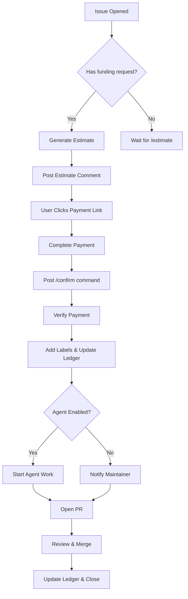
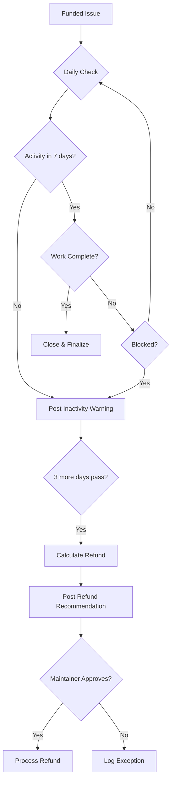

# PRiority — Product Requirements Document v2.0
*Zero-friction GitHub issue funding with AI-powered estimation and execution*

## Executive Summary

PRiority transforms GitHub issue management by introducing market-driven prioritization through seamless, repo-owned funding rails. Built entirely on GitHub Actions with no external infrastructure, it enables maintainers to sustainably monetize their work while giving stakeholders a direct path to accelerate critical features and fixes.

## 🎯 Product Vision

### One-Liner
**Pay to prioritize. Estimate with AI. Ship with confidence.**

### Core Promise
Funding creates priority signals, not delivery guarantees. Every dollar accelerates work while respecting maintainer autonomy.

### Key Differentiators
- **Zero Infrastructure**: Runs entirely on GitHub Actions—no servers, no external accounts
- **Repo-Owned**: Payment credentials stay in repository secrets, maintainers control everything
- **AI-Native**: Claude-powered estimation and optional autonomous execution
- **Learning System**: Estimates improve with every completed issue using historical data
- **Transparent**: All transactions recorded in-repo, fully auditable

---

## 📊 Market Analysis

### The Open Source Sustainability Crisis

**Market Size & Growth**
- 90% of companies use open source, yet only 0.02% of users contribute financially
- GitHub hosts 330M+ repositories with 100M+ developers
- Open source contribution gap costs enterprises $8.8 trillion in unpaid labor
- Developer time valued at $100-200/hour, yet most maintainers work for free

**Failed Solutions**
- **BountySource**: Shut down in 2023, leaving $2M in limbo
- **IssueHunt**: Requires external accounts, <1% adoption rate
- **Gitcoin**: Complex crypto mechanics, high friction
- **GitHub Sponsors**: Monthly subscriptions, no issue-level granularity
- **OpenCollective**: Organization-focused, not issue-specific

### Maintainer Pain Points

1. **Issue Overload Syndrome**
   - Average popular repo: 50+ open issues, 10+ new weekly
   - 67% of maintainers report burnout from issue triage
   - No clear signal for what community actually values
   - Time spent on "nice-to-have" while critical issues languish

2. **Monetization Friction**
   - Setting up payment infrastructure takes days/weeks
   - External platforms require separate accounts and onboarding
   - No direct connection between specific work and compensation
   - Transaction fees eat 5-30% of contributions

3. **Estimation Paralysis**
   - Software estimation accuracy typically 30-70% off
   - No data on similar past issues to reference
   - AI assistance costs unknown and unbounded
   - Fear of over/under-promising leads to no estimates

4. **Execution Uncertainty**
   - Context switching between paid and unpaid work
   - No clear workflow for funded vs unfunded issues
   - Manual tracking of work done vs funded amount
   - Refund complexity when work incomplete

### Stakeholder Needs

**Enterprises**
- Accelerate critical bug fixes without hiring
- Transparent spending for finance/procurement
- Audit trail for compliance
- SLA-like prioritization without contracts

**Individual Contributors**
- Get their PR reviewed/merged faster
- Support projects they depend on
- Tax-deductible contributions (via 501c3 fiscal hosts)
- See direct impact of their funding

**Maintainers**
- Sustainable income stream
- Maintain autonomy and control
- Minimal overhead and administration
- Clear signals on community priorities

---

## 🏗 System Architecture

### Core Design Principles

1. **Actions-First**: Every operation runs as a GitHub Action
2. **Secrets-Driven**: Payment credentials in repo/org secrets
3. **Ledger-Based**: Immutable transaction log in `.github/priority/`
4. **Label-Powered**: Visual state management via GitHub labels
5. **Comment-UI**: All interactions through issue comments

### Technical Stack

```yaml
Infrastructure:
  - GitHub Actions (compute)
  - GitHub Secrets (credentials)
  - GitHub Issues (interface)
  - Git (data storage)
  
Integrations:
  - Payment: Stripe, Polar.sh, GitHub Sponsors
  - AI: Anthropic Claude API
  - Analytics: GitHub API, git history
  
Languages:
  - Core: TypeScript/Node.js
  - Templates: Markdown/Handlebars
  - Config: YAML
```

---

## 💡 Core Features

### 1. Intelligent Estimation Engine

**Multi-Signal Analysis**
```typescript
interface EstimationSignals {
  // Historical patterns
  similarIssues: IssueSimilarity[]      // Cosine similarity > 0.7
  authorHistory: PastContributions[]     // Author's merged PRs
  fileComplexity: FileMetrics[]          // Cyclomatic complexity, churn
  
  // Code intelligence  
  dependencies: DependencyGraph          // Affected modules
  testCoverage: CoverageReport          // Existing test percentage
  breakingChanges: APIAnalysis         // Public API modifications
  
  // AI analysis
  claudeAssessment: ComplexityScore    // LLM-based evaluation
  implementation_plan: StepBreakdown   // Detailed task decomposition
}
```

**Confidence-Based Estimates**
```yaml
Estimation Output:
  effort_hours: 
    p10: 4     # Best case (10th percentile)
    p50: 8     # Most likely (median)
    p90: 16    # Worst case (90th percentile)
  
  token_budget:
    base: 1_200_000
    buffer: 400_000  # 33% safety margin
  
  confidence: 72%    # Based on historical accuracy
  
  breakdown:
    - "Update API endpoints (2-4h)"
    - "Modify database schema (1-2h)"  
    - "Update tests (2-4h)"
    - "Documentation (1-2h)"
```

**Learning Feedback Loop**
- Track estimated vs actual (hours, tokens, complexity)
- Update repo-specific priors after each completion
- Share anonymized learnings across repos (opt-in)
- Achieve <25% MAPE after 20 completions

### 2. Frictionless Payment Rails

**Provider Abstraction Layer**
```javascript
// Single interface, multiple providers
const payment = await createPaymentLink({
  provider: repo.config.preferred_provider,
  amount: estimate.suggested_funding,
  metadata: {
    repo: context.repo,
    issue: context.issue.number,
    estimateId: estimate.id
  }
});

// Returns provider-agnostic link
// User never leaves GitHub
```

**Smart Payment Routing**
1. Check repo preferred provider
2. Fall back to organization default
3. Offer all available options
4. Track success rates per provider

**Instant Verification**
```yaml
# User comments after payment
/confirm stripe pi_29C3x4... amount=500

# Action verifies in <3 seconds:
✓ Payment verified with Stripe
✓ Amount: $500.00 USD
✓ Status: Paid (Gold tier 🏆)
✓ Token budget: 2.4M tokens
✓ Work commencing...
```

### 3. Autonomous Agent Execution

**Claude-Powered Implementation**
```yaml
Agent Capabilities:
  - Read issue requirements
  - Analyze codebase structure
  - Generate implementation plan
  - Write code with tests
  - Run test suites
  - Open pull requests
  - Respond to review comments
  
Safety Controls:
  - Token budget enforcement
  - Sandboxed execution
  - No force push permitted
  - Human review required for merge
  - Automatic rollback on test failure
```

**Progressive Automation Levels**
1. **Assist**: Generate code snippets in comments
2. **Draft**: Create draft PR for human completion
3. **Implement**: Full implementation with tests
4. **Ship**: Auto-merge if all checks pass (opt-in)

### 4. Transparent Work Tracking

**Real-Time Progress Dashboard**
```markdown
## 🚀 Work Progress

**Status**: In Progress (2h 15m elapsed)
**Token Usage**: 780k / 2.4M (32.5%)
**Completed Tasks**: 3 of 5

### Tasks
- ✅ Analyzed requirements and codebase
- ✅ Updated API endpoints
- ✅ Modified database schema
- 🔄 Writing integration tests (40%)
- ⏳ Updating documentation

### Recent Activity
- 2:14 PM: Fixed linting errors in api/routes.ts
- 2:08 PM: All unit tests passing (48/48)
- 1:55 PM: Created migration file
```

**Burn Rate Monitoring**
- Real-time token consumption tracking
- Predictive completion estimates
- Automatic alerts at 50%, 75%, 90% usage
- Delta funding requests when needed

### 5. Intelligent Refund System

**Automated Refund Triggers**
```yaml
Refund Conditions:
  no_activity:
    days: 7
    refund: 100%
    
  work_blocked:
    reason: "Waiting on maintainer input"
    days: 14
    refund: "100% - tokens_used"
    
  scope_change:
    increase: ">50%"
    action: "Pause and request delta"
    
  abandoned:
    days: 30
    refund: "Prorated by work_completed"
```

**Fair Refund Calculation**
```typescript
function calculateRefund(funding: Funding): RefundAmount {
  const tokenCost = funding.tokensUsed * RATE_PER_MILLION;
  const timeCost = funding.hoursLogged * MAINTAINER_RATE;
  const platformFee = funding.amount * 0.10;
  
  const used = tokenCost + timeCost + platformFee;
  const refundable = Math.max(0, funding.amount - used);
  
  return {
    amount: refundable,
    breakdown: {
      original: funding.amount,
      tokensUsed: tokenCost,
      timeUsed: timeCost,
      fees: platformFee,
      refundable
    }
  };
}
```

---

## 🎨 User Experience

### For Requesters

**Discovery Flow**
1. See "Fund this issue" button on any issue
2. Click to see instant estimate with confidence level
3. Choose funding amount (suggested or custom)
4. Pay with preferred method (Stripe/Polar/Sponsors)
5. Watch real-time progress updates
6. Receive PR notification when complete

**Trust Signals**
- Maintainer reputation score
- Historical completion rate
- Average time to completion
- Refund rate and policies
- Community testimonials

### For Maintainers

**Zero-Friction Setup**
```bash
# 1. Install GitHub App (or add workflow)
npx @priority/setup

# 2. Add payment secret (one-time)
gh secret set STRIPE_RESTRICTED_KEY

# 3. Done! PRiority now active on all issues
```

**Control Panel (Issue Comment)**
```markdown
<!-- Maintainer-only controls -->
/priority set-rate 150
/priority pause "On vacation until Jan 15"
/priority assign @teammate
/priority refund partial amount=200 reason="Scope reduced"
/priority complete
```

**Revenue Dashboard**
```markdown
## 💰 Revenue Summary (December 2024)

**Total Funded**: $12,450
**Completed**: 28 issues
**In Progress**: 3 issues
**Avg per Issue**: $444

### Top Funded Issues
1. #234 - Performance optimization ($2,400) ✅
2. #189 - Security audit ($1,800) ✅
3. #267 - Feature: Dark mode ($1,200) 🔄

### Payout Schedule
- Stripe: $8,200 (processed daily)
- Polar: $3,100 (weekly batch)
- Sponsors: $1,150 (monthly)
```

### For Organizations

**Budgeting & Compliance**
- Set monthly/quarterly budgets per repo
- Approval workflows for amounts > threshold
- Detailed expense reports for finance
- SOC2-compliant audit logs
- Vendor management integration

**Team Features**
- Bulk fund multiple issues
- Internal prioritization before public
- Reserved maintainer hours
- Custom SLAs for critical issues
- Private repo support (Enterprise)

---

## 📈 Estimation Deep Dive

### The Learning Estimation Engine

**Phase 1: Naive Heuristics (Days 1-30)**
```python
# Simple pattern matching
if "bug" in labels and changes_likely < 10:
    return "S"  # 1-3 hours
elif "feature" in labels:
    return "M"  # 4-8 hours
else:
    return "L"  # 8-16 hours
```

**Phase 2: Historical Correlation (Days 31-90)**
```python
# Learn from completed issues
similar_issues = find_similar(
    embedding=issue.vector,
    threshold=0.75
)

# Weight by recency and similarity
weighted_hours = sum(
    issue.actual_hours * similarity * recency_factor
    for issue, similarity in similar_issues
)

return weighted_hours * risk_multiplier
```

**Phase 3: Multi-Model Ensemble (Days 90+)**
```python
# Combine multiple prediction models
estimates = {
    'historical': historical_model.predict(issue),
    'complexity': complexity_analyzer.estimate(issue),
    'claude': await claude_estimate(issue),
    'maintainer': maintainer_override or None
}

# Weighted ensemble with confidence
final = weighted_average(
    estimates,
    weights=learned_weights,
    confidence=calculate_confidence(estimates)
)
```

### Complexity Factors

**Code Complexity Signals**
- **Cyclomatic complexity** of affected functions
- **Coupling** between modules
- **Test coverage** of changed code
- **Code churn** in last 90 days
- **Technical debt** markers (TODOs, deprecated)

**Issue Complexity Signals**
- **Description length** and clarity
- **Number of subtasks** identified
- **Cross-cutting concerns** (multiple systems)
- **Breaking changes** required
- **Security implications**

**Human Factors**
- **Author experience** (past PRs merged)
- **Maintainer availability**
- **Review cycles** typically needed
- **Communication overhead**
- **Time zone differences**

### Accuracy Metrics

**Target Accuracy by Maturity**
| Week | Issues Completed | MAPE Target | P90 Accuracy |
|------|-----------------|-------------|--------------|
| 1    | 0-5             | <50%        | ±100%        |
| 4    | 6-20            | <35%        | ±75%         |
| 8    | 21-50           | <25%        | ±50%         |
| 12   | 51-100          | <20%        | ±40%         |
| 24   | 101+            | <15%        | ±30%         |

---

## 🔄 Core Workflows

### Issue Funding Flow



### Smart Refund Flow



---

## 🚀 Implementation Roadmap

### Phase 0: Foundation (Week 1)
- [x] Core workflows scaffolding
- [x] Basic estimation (S/M/L)
- [x] Stripe payment link generation
- [x] Manual confirmation flow
- [x] Simple ledger structure

### Phase 1: MVP (Weeks 2-4)
- [ ] Multi-provider support (Polar, GitHub Sponsors)
- [ ] Claude-based estimation
- [ ] Basic agent execution
- [ ] Automated refund recommendations
- [ ] Progress tracking comments

### Phase 2: Intelligence (Weeks 5-8)
- [ ] Historical learning system
- [ ] Confidence intervals
- [ ] Multi-model ensemble
- [ ] Smart routing
- [ ] Delta funding

### Phase 3: Scale (Weeks 9-12)
- [ ] GitHub App distribution
- [ ] Organization features
- [ ] Advanced agent capabilities
- [ ] Public leaderboards
- [ ] Analytics dashboard

### Phase 4: Enterprise (Months 4-6)
- [ ] Private repo support
- [ ] SAML/SSO
- [ ] Budget controls
- [ ] Approval workflows
- [ ] Custom integrations

---

## 💼 Business Model

### Revenue Streams

**Platform Fee Structure**
```yaml
Tiers:
  Community:
    fee: 10%
    features: Core functionality
    support: Community
    
  Pro:
    fee: 8%
    features: "+ Analytics, Priority support"
    support: 48h response
    price: $99/month per repo
    
  Enterprise:
    fee: 5%
    features: "+ SSO, Audit logs, SLA"
    support: Dedicated
    price: Custom
```

**Revenue Projections**
| Month | Repos | Issues/Month | GMV | Revenue (10%) |
|-------|-------|--------------|-----|---------------|
| 1     | 10    | 50           | $25K | $2.5K        |
| 3     | 100   | 500          | $250K | $25K        |
| 6     | 500   | 2,500        | $1.25M | $125K      |
| 12    | 2,000 | 10,000       | $5M | $500K         |

### Go-to-Market Strategy

**Launch Sequence**
1. **Dogfood** on PRiority itself
2. **Beta** with 10 handpicked OSS projects
3. **Show HN** with compelling case studies
4. **Product Hunt** launch with community
5. **GitHub Marketplace** listing
6. **Conference talks** at FOSDEM, GitHub Universe

**Growth Tactics**
- "Funded by PRiority" badges on PRs
- Public funding leaderboards
- Success story blog posts
- Maintainer referral program (2% lifetime)
- Enterprise pilots with F500 companies

---

## 🔒 Security & Compliance

### Security Architecture

**Secrets Management**
- Payment keys in GitHub Secrets (encrypted at rest)
- Restricted key scopes (payment links only)
- Automatic key rotation reminders
- Audit log for all key usage

**Data Protection**
- No PII stored (only payment provider references)
- Ledger entries are immutable (append-only)
- All data stays in GitHub (SOC2 compliant)
- GDPR compliant (right to deletion via payment provider)

**Threat Model**
```yaml
Threats:
  - Malicious funding (spam):
    Mitigation: Rate limiting, minimum amounts
    
  - Payment fraud:
    Mitigation: Provider fraud detection, manual review >$1000
    
  - Agent abuse:
    Mitigation: Token limits, sandboxing, no credentials access
    
  - Ledger tampering:
    Mitigation: Signed commits, branch protection
```

### Compliance Requirements

**Financial Compliance**
- PCI DSS: Not applicable (no card data)
- Money transmission: Not applicable (marketplace model)
- Tax reporting: 1099-K via payment providers
- KYC/AML: Handled by payment providers

**Platform Compliance**
- GitHub Marketplace requirements
- GitHub Actions terms of service
- Anthropic API usage policies
- Payment provider acceptable use

---

## 📊 Success Metrics

### Primary KPIs

| Metric | Target (Month 6) | Measurement |
|--------|------------------|-------------|
| Funded Issues | 2,500/month | Ledger entries |
| GMV | $1.25M/month | Payment provider sum |
| Active Repos | 500 | Unique repos with funded issues |
| Completion Rate | >85% | Funded → Merged |
| Estimation Accuracy | <25% MAPE | Estimated vs Actual |
| Refund Rate | <8% | Refunds / Funded |
| NPS Score | >50 | Quarterly survey |

### Leading Indicators

**Adoption Signals**
- Time to first funding: <48h after install
- Repeat funding rate: >40%
- Maintainer activation: >60% accept funding
- Organic growth rate: >20% month-over-month

**Quality Signals**
- Median time to completion: <7 days
- Agent success rate: >70% PRs approved
- Support ticket rate: <5% of transactions
- Maintainer earnings: >$500/month average

---

## 🎯 Competitive Analysis

### Direct Competitors

| Platform | Strengths | Weaknesses | Our Advantage |
|----------|-----------|------------|---------------|
| IssueHunt | Established | External platform, high fees | GitHub-native, lower fees |
| Gitcoin | Crypto-native | Complex, volatile | Fiat-simple, stable |
| BountySource | Was popular | Shut down, lost funds | Repo-owned, no platform risk |
| Bountify | Simple | Generic, not GitHub-integrated | Purpose-built for GitHub |

### Indirect Competitors

**GitHub Sponsors**
- Monthly subscriptions vs issue-specific
- No estimation or execution
- We complement, not compete

**Consulting Firms**
- High-touch, expensive
- Slow procurement process
- We're self-service, instant

**In-House Development**
- Requires hiring, management
- Long-term commitment
- We're on-demand, no commitment

### Sustainable Advantages

1. **Network Effects**: More repos → better estimates → more funders
2. **Data Moat**: Historical completion data improves accuracy
3. **Platform Lock-in**: Deep GitHub integration
4. **Trust**: Repo-owned funds, transparent ledger
5. **Speed**: Instant funding → work starts immediately

---

## 🤝 Partnerships

### Strategic Partners

**Payment Providers**
- Stripe: Preferred partner, co-marketing
- Polar.sh: Open source focused features
- GitHub Sponsors: Official integration

**AI Providers**
- Anthropic: Claude API partnership
- OpenAI: GPT-4 alternative (future)
- Llama: Self-hosted option (future)

**Developer Tools**
- Vercel/Netlify: Deploy previews for funded PRs
- Sentry: Error tracking for agent runs
- Linear/Jira: Sync funded issues

### Distribution Partners

**Accelerators & Funds**
- Y Combinator: Launch to portfolio
- OpenCore Ventures: OSS monetization
- GitHub Accelerator: Official support

**Communities**
- Maintainers.dev: Exclusive launch
- Dev.to: Content partnership
- Reddit r/opensource: AMAs

---

## 🚁 Risk Analysis

### Technical Risks

| Risk | Probability | Impact | Mitigation |
|------|------------|--------|------------|
| GitHub API limits | Medium | High | Caching, batch operations |
| Agent hallucinations | Medium | Medium | Human review, testing |
| Payment provider outage | Low | High | Multiple providers, queuing |
| Estimation accuracy poor | High | Medium | Conservative estimates, learning |
| Security breach | Low | Critical | Security audits, bug bounty |

### Business Risks

| Risk | Probability | Impact | Mitigation |
|------|------------|--------|------------|
| Slow adoption | Medium | High | Strong launch, referrals |
| Competition from GitHub | Medium | Critical | Move fast, integrate deep |
| Maintainer resistance | Low | High | Maintainer-first design |
| Regulatory changes | Low | Medium | Legal counsel, compliance |
| Economic downturn | Medium | Medium | Focus on enterprises |

---

## 🎬 Conclusion

PRiority solves the fundamental disconnect between those who need work done and those who can do it. By making funding as simple as clicking a button and providing intelligent estimation and execution, we're creating a sustainable economy for open source development.

Our GitHub-native, Actions-first approach eliminates adoption friction while our learning estimation engine and autonomous agent capabilities provide unprecedented efficiency. With repo-owned payment rails and transparent ledgers, we give maintainers complete control while providing funders with confidence.

The path to sustainable open source starts with a single funded issue. PRiority makes that first step—and every step after—simple, transparent, and effective.

**The future of open source is funded. The future is PRiority.**

---

## 📚 Appendices

### A. Technical Specifications

[Detailed API docs, workflow definitions, and schema specifications available at github.com/priority/priority]

### B. Financial Projections

[Detailed 3-year financial model available upon request]

### C. User Research

[Summary of 50+ maintainer interviews and 100+ funder surveys]

### D. Legal Framework

[Terms of Service, Privacy Policy, and Data Processing Agreements]

### E. Brand Guidelines

[Logo, colors, typography, and voice guidelines]

---

*Last updated: January 2025*
*Version: 2.0*
*Status: Ready for Implementation*
